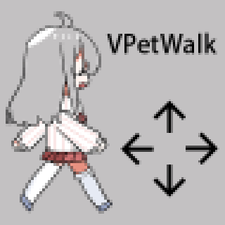

# VPetWalk 插件
VPetWalk（虚拟桌宠移动）是 [虚拟桌宠模拟器（VPet）](https://github.com/LorisYounger/VPet) 的一个插件，用于为虚拟桌宠添加键盘方向键（↑ ↓ ← → 或 WASD）控制移动的功能

以往桌宠只能随机移动，现在可以通过方向键自由地控制她的行动了，恭喜恭喜~

# 使用方法
将窗口聚焦到桌宠身上后，即可通过方向键控制桌宠移动

Ciallo～(∠・ω< )⌒☆

